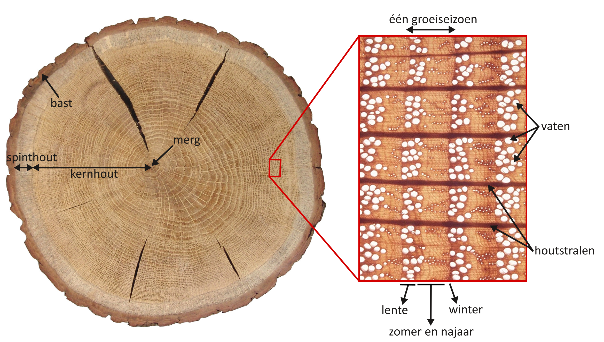
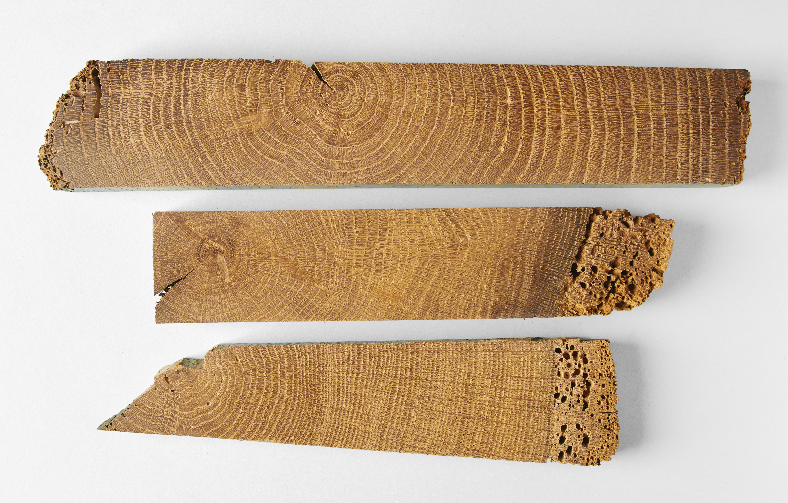
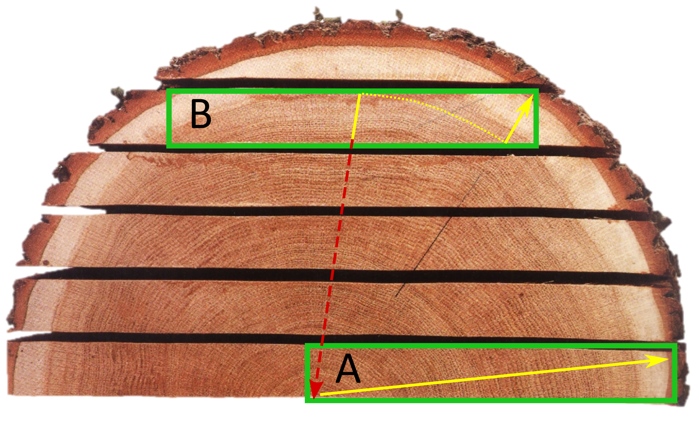
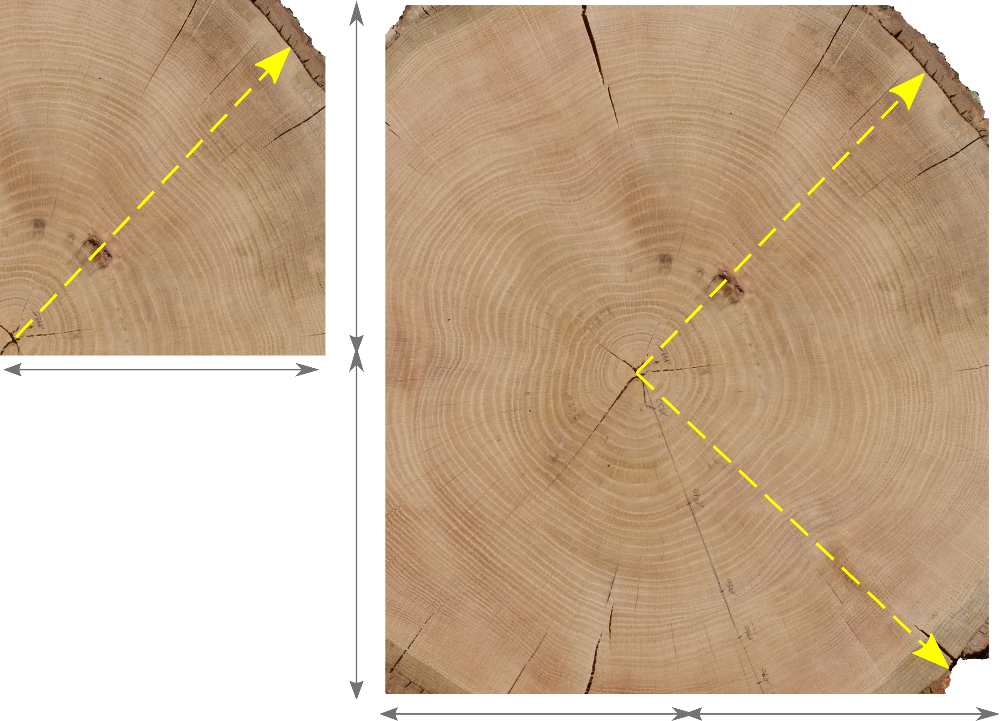
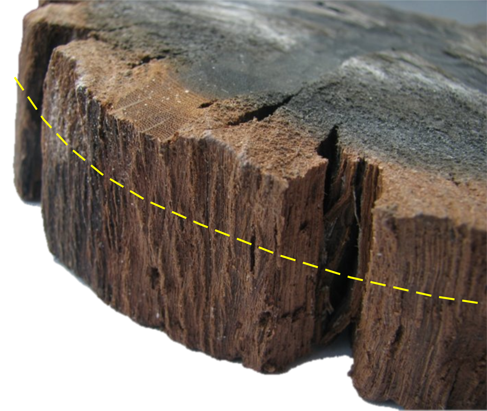

# Randvoorwaarden en basisbegrippen {#randvoorwaarden}

## Houtsoort

Niet alle houtsoorten komen in aanmerking voor een daterend dendrochronologisch onderzoek. Sommige boomsoorten vormen in onze streken immers een jaarringpatroon dat zich niet of nauwelijks laat synchroniseren. Daarom zal een dendrochronologische analyses steeds starten met het bepalen van de houtsoort. Hout is opgebouwd uit verschillende types van cellen die samen een aantal kenmerkende weefsels vormen, karakteristiek voor elke houtsoort. Om de houtsoort te bepalen op basis van de anatomische opbouw van het hout moeten de weefsels en celtypes met behulp van een microscoop bestudeerd worden vanuit drie gezichtspunten: het transversaal, radiaal en tangentiaal vlak (figuur \@ref(fig:hout3D)).

Op het transversaal vlak - ook wel het 'kopse' vlak genoemd, wat overeen komt met een dwarse doorsnede van een stam of tak - is het met behulp van een vergrootglas of microscoop mogelijk om op basis van de geobserveerde celstructuren en weefsels de houtsoort te bepalen. Een eerste belangrijk kenmerk bij **loofhout** is de schikking van de houtvaten. Deze vaten - die op het transversaal vlak te zien zijn als poriën - vormen een netwerk van kanalen waarbinnen zich de sapstroom van de wortels naar de bladeren afspeelt. De schikking van die vaten binnen een jaarring kan gelijkmatig zijn (verspreidporig hout) of geordend in banden waarbij tevens ook de diameter van de vaten sterk kan verschillen (ringporig hout), of volgens een aantal tussenvormen (semi-ringporig). Op het transversaal vlak zijn ook straalvormige weefsels te zien die georienteerd zijn van het merg naar de schors: de houtstralen (figuur \@ref(fig:hout3D)). De opslag en het inwaarts transport van water en voedingsstoffen is hun belangrijkste functie. De breedte van die houtstralen, die op het tangentiaal vlak accuraat is waar te nemen, en hun opbouw (best waar te nemen op het radiaal vlak) is vaak een belangrijk kenmerk om soorten van elkaar te onderscheiden. **Naaldhout** heeft een veel eenvoudiger opbouw dan hout van loofbomen en bestaat hoofdzakelijk uit een celtype dat zowel instaat voor het transport van voedingstoffen en de nodige stevigheid garandeert. Bij naaldhout zijn op het transversaal vlak soms ook ronde doorboringen te zien, maar dit zijn geen vaten maar harskanalen. De combinatie van alle kenmerken die waarneembaar zijn op het transversaal, tangentiaal en radiaal vlak van het hout, laat toe om te bepalen tot welke botanische familie of genus een boom behoort, en dikwijls zelfs tot welke soort.

In Vlaanderen is er binnen het erfgoedonderzoek op houten objecten en structuren een onbetwistbare hoofdrolspeler: de eik. Deze benaming omvat twee verschillende botanische soorten: nl. **zomer- en wintereik** (resp. *Quercus robur* en *Q. petraea*), die weliswaar een zeer vergelijkbare houtanatomie hebben. Bij een daterend dendrochronologisch onderzoek moet tussen beide soorten geen onderscheid gemaakt worden, aangezien ze onder vergelijkbare groeiomstandigheden een gelijkaardig jaarringpatroon ontwikkelen. Deze houtsoort laat zich bovendien vrij gemakkelijk herkennen, zowel in natte (bij archeologisch terreinonderzoek) als droge toestand (constructiehout in bouwkundig erfgoed of bij sculpturen en paneelschilderijen). Door de microscopische opbouw van het hout te bekijken, kan je op vrij eenvoudige wijze vaststellen of het eikenhout betreft. Maar een aantal kenmerken zijn ook met het blote oog, of met behulp van een loep (10x), gemakkelijk te observeren. Daarvoor snij je op het kopse vlak (= het transversaal vlak, figuur \@ref(fig:jaarringEik)) een kleine zone glad, met een scherp breekmes, scheermesje of scalpel (veiliger!). Je kan besluiten dat het om eikenhout gaat indien volgende kenmerken duidelijk waarneembaar zijn met het blote oog, of met behulp van een loep (10x)(figuur \@ref(fig:jaarringEik)): 

```{r jaarringEik, fig.cap = 'Detailopname van het transversaal (= kopse) vlak van een eiken stam.', echo = FALSE, out.width='80%', fig.asp=.75, fig.align='center'}



```


  - duidelijk herkenbare groeiringen op het kopse vlak (transversaal),
  - een poreuze zone (= lentehout of vroeghout) met grote vaten (te herkennen als gegroepeerde, ronde poriën) afgewisseld met een zone zonder duidelijk te observeren vaten (zomerhout of laathout),
  - met het blote oog herkenbare, brede, licht glanzende houtstralen die vanuit de kern naar de schors toe lopen.

Op het radiaal vlak zijn dikwijls 'spiegels' te zien op het eikenhout: dit zijn glanzende, brede lijnen met een soms grillig verloop. Het zijn de houtstralen die in de lengterichting worden aangesneden. Aan de buitenzijde van het stamhout is bij eik ook een blekere zone te zien. Dit is het spinthout (zie verder), wat bij eik typisch bleker gekleurd is dan het kernhout.


> 
> **Eikenhout kan je met het blote oog (of met een handloep) vrij gemakkelijk herkennen aan de hand van enkele typische kenmerken.**
> 
<br/>

```{r archeoEik, fig.cap = 'Detailopname van een stuk eikenhout gevonden bij archeologisch veldonderzoek. Op het kopse vlak zijn alle houtanatomische structuren die kenmerkend zijn voor eikenhout - zoals de grote vaten in het vroeghout en de brede houtstralen - duidelijk te observeren. De blekere zone aan de buitenzijde is het spinthout.', echo = FALSE, out.width='80%', fig.asp=.75, fig.align='center'}

knitr::include_graphics("./figuren/Dendrochronologie/Dendro_Figuur05.png")

```


Ook andere loofhoutsoorten, zoals **beuk** (*Fagus sylvatica*), **es** (*Fraxinus excelsior*) en **olm** (*Ulmus* spp.) hebben in onze streken een zeker potentieel voor daterend dendrochronologisch onderzoek, al zijn er beduidend minder referentiekalenders ter beschikking.

Naaldhoutsoorten als **zilverspar** (*Abies alba*), **fijnspar** (*Picea abies*) en **grove den** (*Pinus sylvestris*) komen eveneens in aanmerking voor daterend dendrochronologisch onderzoek. Naaldhout heeft een eenvoudiger opbouw dan loofhout. Bij grove den zijn met een handloep ook buisvormige kanalen te zien, maar deze zijn niet zo talrijk en ook niet gegroepeerd (figuur \@ref(fig:groveDen)). In tegenstelling tot bij loofhout zijn dit geen vaten, maar harskanalen. Bij ons wijst dendrochronologisch onderzoek van naaldhout dikwijls uit dat het werd aangevoerd uit regio's waar grove den, fijnspar of zilverspar - in tegenstelling tot Vlaanderen - wel van nature voorkomt. In onze streken werd naaldhout pas vanaf de 18de eeuw aangeplant.


```{r groveDen, fig.cap = 'Detailopname van een stuk grove den. De cirkelvormige structuren op het transversaal vlak zijn harskanalen.', echo = FALSE, out.width='80%', fig.asp=.75, fig.align='center'}

knitr::include_graphics("./figuren/Dendrochronologie/Dendro_Figuur06.png")

```


## Aantal ringen

De ervaring leert dat een stuk hout enkel geschikt is voor daterend dendrochronologisch onderzoek indien er **minstens 70 groeiringen** af te lezen zijn op een dwarse doorsnede. Indien het opgemeten groeiringpatroon korter is, kan een eventuele overeenkomst met een referentiekalender nooit met zekerheid gevalideerd worden - zowel statistisch als louter visueel. Globaal gezien kan je stellen dat hoe meer ringen er kunnen opgemeten worden op een stuk hout (= hoe langer het jaarringpatroon), des te hoger de kans op een geslaagde datering.

```{r groeisnelheid, fig.cap = 'Drie stukken eikenhout. Het stuk bovenaan is snel gegroeid en heeft ca. 31 brede ringen, het stuk onderaan is traag gegroeid en telt ca. 92 smalle jaarringen. Bij het middelste stuk is het jaarringpatroon sterk verstoord. Bij de onderste twee stukken is het spinthout zwaar aangetast door insectenvraat.', echo = FALSE, out.width='100%', fig.asp=.75, fig.align='center'}



```


Het aantal ringen dat te zien is op een stuk hout hangt in grote mate samen met de **groeisnelheid van de boom**. Indien een boom traag is gegroeid, zullen in het hout smalle groeiringen te zien zijn; een boom die snel is gegroeid zal in zijn stam brede groeiringen gevormd hebben (figuur \@ref(fig:groeisnelheid) en \@ref(fig:orientatie)). Dit heeft tot gevolg dat zelfs grote stukken hout, als ze afkomstig zijn van een snel gegroeide boom, toch nog te weinig groeiringen kunnen hebben om tot een sluitende datering te komen. De diameter van een stuk hout is dus van minder belang dan de groeisnelheid van de boom.

```{r orientatie, fig.cap = 'Drie plankjes uit eikenhout. (a) Snel gegroeid eikenhout met brede jaarringen. Dit stuk is kwartiers gezaagd (= loodrecht op de jaarringen). Op het radiaal vlak zijn glanzende spiegels te zien. Dit zijn de houtstralen die overlangs worden aangesneden. (b) Traag gegroeid stuk eikenhout met heel smalle jaarringen. Deze plank is dosse gezaagd. (c) Een stuk subfossiel eikenhout met een gemiddelde en regelmatige groei. De pijlen wijzen in de richting van de bast.', echo = FALSE, out.width='80%', fig.asp=.75, fig.align='center'}

knitr::include_graphics("./figuren/Dendrochronologie/Dendro_Figuur08.png")

```


Daarnaast wordt het aantal voor een datering bruikbare jaarringen ook bepaald door de wijze waarop de stam is **verzaagd of gekliefd**. Het verspanen van een stam tot de gewenste palen, planken of panelen speelt dus een belangrijke rol. Op planken die 'dosse' gezaagd zijn - dit is de meest eenvoudige manier om een stam te verzagen, nl. in evenwijdige stroken - zijn doorgaans minder ringen af te lezen dan bij planken die kwartiers gezaagd of gekliefd zijn (figuur \@ref(fig:zaagwijze)). Een stam kan gekantrecht worden tot een zware balk, of opgedeeld tot een aantal balken met kleinere afmetingen. Toch kan het aantal ringen dat valt af te lezen op het kopse vlak bij beide types balken ongeveer hetzelfde zijn (figuur \@ref(fig:balk)).

```{r zaagwijze, fig.cap = "Een stam die 'dosse' wordt verzaagd levert planken op met vergelijkbare afmetingen, maar het jaarringpatroon dat valt af te lezen, is afhankelijk van de positie binnen de stam. Op planken waar zowel het merg als de buitenzijde van de stam aanwezig zijn (plank A), kunnen veel meer ringen worden opgemeten dan bij planken met jaarringen die een sterke kromming vertonen (plank B). Het op te meten jaarringpatroon is aangeduid in geel; de 'ontbrekende' ringen bij een zuiver dosse plank zijn aangeduid met de rode pijl.", echo = FALSE, out.width='80%', fig.asp=.75, fig.align='center'}



```


De **afmetingen van een stuk hout** zeggen dus weinig over het aantal jaarringen dat kan opgemeten worden. Het is beter om de selectie van te bemonsteren stukken hout niet al te veel te laten bepalen door hun afmetingen.

```{r balk, fig.cap = 'Twee balken afkomstig uit eenzelfde stam. De balk aan de linkerzijde is bekomen door de stam in 4 delen te klieven, de balk aan de rechterzijde is bekomen door de originele stam enkel te kantrechten. De oppervlakte van de dwarse doorsnede van de kleine balk bedraagt slechts een kwart van de grote balk, maar toch is het dat kan worden opgemeten even lang (aangeduid in geel).', echo = FALSE, out.width='80%', fig.asp=.75, fig.align='center'}



```

   
>    
>**Het is best om de selectie van te bemonsteren stukken hout niet al te veel te laten bepalen door hun afmetingen.**
>    
   

## Regelmatige groei

De aanwezigheid van **zware takken, wondweefstel of kwasten ** (ingegroeide takaanzet) verstoort lokaal het groeiringpatroon (figuur \@ref(fig:groeisnelheid)). De jaarringen zijn op die plaatsten abnormaal breed of smal en geven geen correct beeld van de globale houtaanwas. Het is daarom beter om dergelijke zones in het hout te vermijden voor daterend dendrochronologisch onderzoek. Ook wortels en takken zijn, door hun doorgaans grillige vorm, minder of niet geschikt.

Een onregelmatige groei kan ook het gevolg zijn van menselijk ingrijpen op de boomgroei, bijvoorbeeld door de boom regelmatig te snoeien. Afhankelijk van de intensiteit van dit ingrijpen, kan dit een duidelijke invloed hebben op de diktegroei - en dus de breedte van de jaarringen - in de daaropvolgende jaren. Deze onregelmatigheid in het groeiringpatroon zal opgemerkt worden over de volledige omtrek van de boom, en zich niet manifesteren als een lokale 'verstoring'.


## Spinthout en wankant

Voor de precisie van de datering zijn stukken hout met wankant of een gedeelte van het **spinthout** het meest informatief. Spinthout bevindt zich tussen het verkernde deel van de stam en de schors van de boom (figuur \@ref(fig:hout3D) en \@ref(fig:jaarringEik)). Het spinthout is het levende houtweefsel dat de sapstroom verzorgt in de stam en dient als opslagplaats voor voedingsstoffen. Het heeft exact dezelfde structuur als het kernhout, maar bij het spinthout zijn de transportkanalen (vaten bij loofhout) nog grotendeels vrij. Dit in tegenstelling tot het kernhout, dat dood houtweefsel is waar geen actief transport van water en voedingsstoffen meer kan plaatsvinden.

De **wankant** krijg je te zien als de bast van de stam wordt gehaald. Het is de scherpe overgang van de bast naar het spinthout (figuur \ref(fig:hout3D)). Het is de zone waar het cambiumweefsel nieuw hout (afgezet naar de binnenzijde van de stam) en bast (naar de buitenzijde van de stam) vormt tijdens het groeiseizoen. Een stuk bouwhout waarbij de wankant bewaard is gebleven, kan je herkennen aan het afgeronde oppervlak waar de buitenzijde van de originele boom nog in is te herkennen (figuur \@ref(fig:wankant)). Indien de bast nog aan een stuk bouwhout vast hangt, dan is de wankant zeker aanwezig. De aanwezigheid van de wankant geeft aan dat de groeiring die werd gevormd tot aan het afsterven van de boom nog bewaard is gebleven.

```{r wankant, fig.cap = 'Stuk archeologisch eikenhout waarop de wankant zichtbaar is. De afgeronde vorm volgt de omtrek van de originele stam (foto: &copy; Van Daalen Dendrochronologie).', echo = FALSE, out.width='80%', fig.asp=.75, fig.align='center'}



```


Aangezien stukken hout met wankant of (een gedeelte van het) spint tot een heel precieze datering kunnen leiden (zie: [*hoofdstuk 4: Interpretatie*](#interpretatie)), moeten dergelijke stukken steeds voorrang krijgen bij een staalname. Het spinthout is ook het minst duurzame gedeelte van een stam. Daardoor is het dikwijls ook het meest gedegradeerd of werd het bij het bewerken van het hout reeds preventief verwijderd. Bij de staalname worden daarom best maatregelen genomen zodat, indien nog aanwezig, de schors en/of het spinthout aan het (kern-)hout vast blijft zitten. Archeologisch hout met spint mag daarom zeker niet uitdrogen. Dit gedeelte zal tijdens het drogen immers het sterkst vervormen (zie bijvoorbeeld figuur \@ref(fig:archeoEik)) en aldus onbruikbaar worden voor jaarringanalyse. Bij droog hout is het spinthout vaak het zwaarst aangetast door insecten (zie bijvoorbeeld het spinthout van de houtstalen in figuur \@ref(fig:groeisnelheid), die volledig zijn aangetast door insectenvraat). Ook hier is het aangewezen om het uiteenvallen van het spinthout tegen te gaan door extra voorzichtig om te springen met de spinthoutzone.

