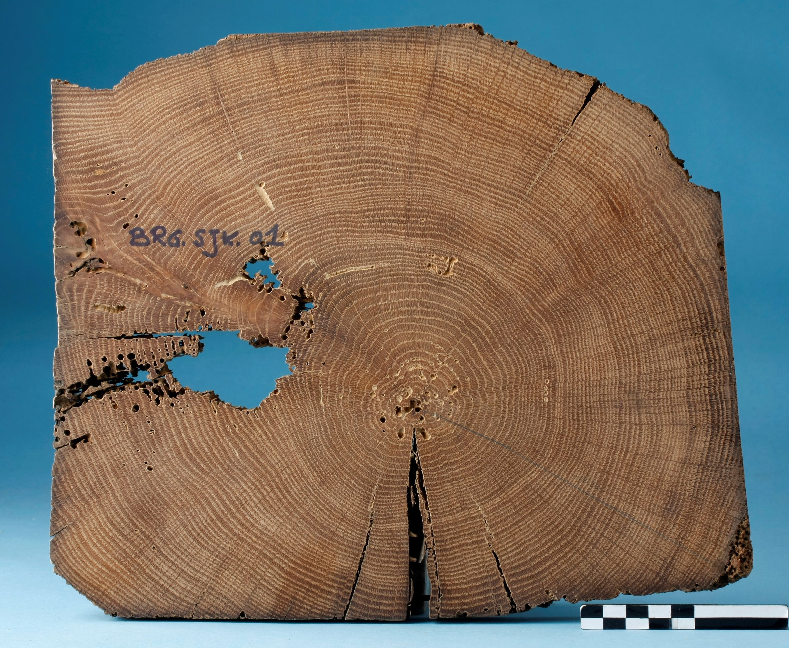

# Dendrochronologie en erfgoedonderzoek

Welkom bij de online versie van “*dendrochronolgie en
erfgoedonderzoek*”. Deze handleiding werd in 2017 gepubliceerd door
het agentschap Onroerend Erfgoed en is als pdf te downloaden op de
[**Open Archives Repositiry
(OAR)**](https://oar.onroerenderfgoed.be/item/437).

Met deze online versie willen we kleine aanpassingen aan de originele
uitgave, veranderende inzichten en nieuwe toepassingen van
dendrochronologie binnen het erfgoedonderzoek - op basis van recente,
wetenschappelijke ontwikkelingen - sneller ontsluiten. De basis van deze
handleiding blijft de originele uitgave, maar :point\_right:
[**hier**](https://hanecakr.github.io/handleidingDendro/) :point\_left:
kan je steeds de meest actuele versie raadplegen.

> Gelieve te citeren als:   Haneca K. (2020-08-13).
> Dendrochronologie en erfgoedonderzoek. Handleiding agentschap
> Onroerend Erfgoed, Brussel \[online:
> <https://hanecakr.github.io/handleidingDendro/>\]
> 
> Oorspronkelijke gepubliceerd als:   Haneca K. (2017).
> Dendrochronologie en erfgoedonderzoek, Handleiding agentschap
> Onroerend Erfgoed, Brussel \[online:
> <https://oar.onroerenderfgoed.be/uitgave/251>\].

  Kristof Haneca   13 augustus, 2020 

 © Flanders Heritage Agency
