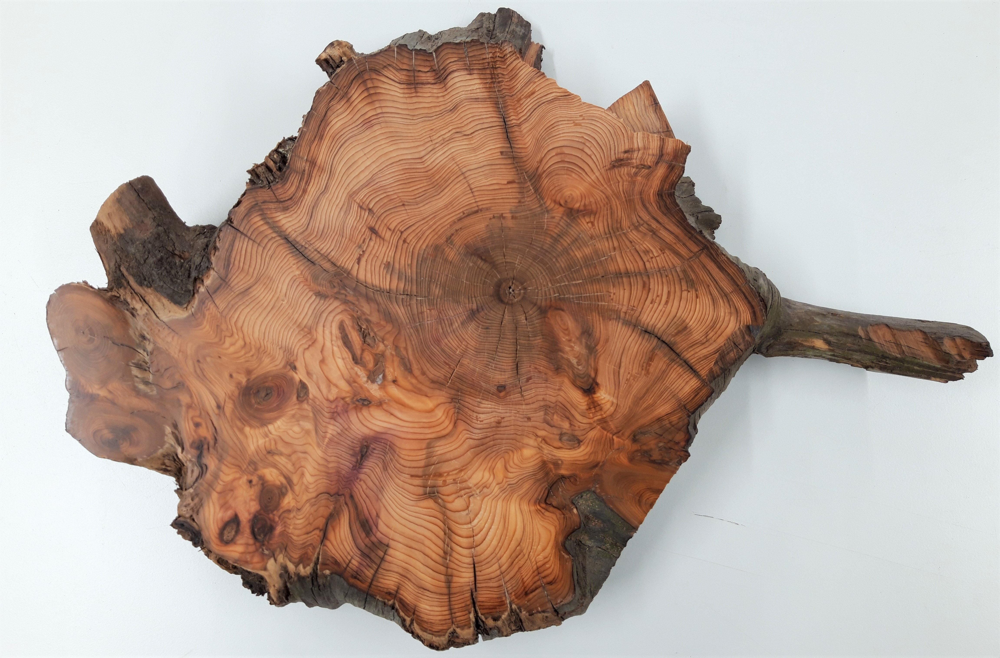

# Inleiding {#intro}

## Dendrochronologie in het erfgoedonderzoek

Dendrochronologie is de studie van groeiringen in houtige planten. Het is binnen de natuurwetenschappen een sterk uitgebouwd onderzoeksdomein met een eigen methodologie, dat ook daarbuiten vele praktische toepassingen kent. Binnen de erfgoedwereld bedienen het archeologisch, het historisch en het bouwhistorisch onderzoek zich van de resultaten van de dendrochronologie. En toch is niet iedereen binnen deze vakgebieden reeds ten volle op de hoogte van de mogelijkheden van het dendrochronologisch onderzoek. Nog te vaak verdwijnt oud hout, zonder dat het onderzocht is, bij archeologische opgravingen, bij de restauratie van bouwkundig erfgoed of bij de omgang met levend houtig erfgoed in onze landschappen.

>      
> Dendrochronologie is de meest precieze natuurwetenschappelijke dateringstechniek.
>   

Het onderwaarderen van oud hout als informatiebron in de context van erfgoedstudies heeft vooral te maken met een onderschatting van het potentieel aan informatie dat dendrochronologisch onderzoek kan bieden, niet enkel in een puur wetenschappelijke context maar ook in dossiers rond bescherming, behoud, beheer en studie van het boven- en ondergrondse erfgoed. Bovendien is er grote onzekerheid over wat een keuze van materiaal of staalname voor dendrochronologisch onderzoek precies inhoudt. Om de nodige kennis en ervaring te versterken, is wat toelichting op zijn plaats. Deze praktische handleiding probeert dan ook de belangrijkste principes van jaarringenonderzoek, mogelijke onderzoeksvragen en de nodige aandachtspunten bij een staalname scherp te stellen. Om tot een correcte interpretatie van de resultaten van een dendrochronologisch onderzoek te komen, worden een aantal praktische voorbeelden gegeven.

 

## Leeswijzer

In wat volgt, worden eerst de basisprincipes ([hoofdstuk 2](#basis)) van de dendrochronologie kort behandeld. Vanuit deze kennis worden een aantal onderzoeksvragen ([hoofdstuk 3](#onderzoeksvragen)) geformuleerd, relevant voor het onderzoek van houten constructies en voorwerpen met erfgoedwaarde, rekening houdend met een aantal randvoorwaarden ([hoofdstuk 4](#randvoorwaarden)). Het dendrochronologisch onderzoek kan daarna starten met de staalname. In deze handleiding worden enkele praktische richtlijnen meegegeven voor het nemen van de meest geschikte stalen van stukken hout met erfgoedwaarde ([hoofdstuk 5](#bemonsteren)). De bewaring ([hoofdstuk 6](#bewaren)) van de stalen, de documentatie ([hoofdstuk 7](#specialist)) die deze stalen moet vergezellen en de uiteindelijke analyse ([hoofdstuk 8](#analyse)) worden eveneens toegelicht. Na het opmeten en de analyse door de specialist is uiteraard een correcte rapportage van de resultaten ([hoofdstuk 9](#rapporteren)) nodig vooraleer men tot een correcte interpretatie van de onderzoeksresultaten ([hoofdstuk 4](#interpretatie) kan komen. Mocht een dendrochronologisch onderzoek uiteindelijk toch niet het gewenste resultaat opleveren, kan de wisselwerking met radiokoolstofdatering alsnog een uitweg bieden ([hoofdstuk 10](#C141)).

<!-- ## Meer weten? -->

<!-- De boeken, richtlijnen, wetenschappelijke en meer vulgariserende artikels die je in de [bronnenlijst](#bronnen) kan vinden, inspireerden niet alleen tijdens het schrijven van deze handleiding, maar vormen een pakket aan verdiepende literatuur over dendrochronologie als wetenschappelijke discipline. Daarnaast omvat deze literatuurlijst ook bron aan verhalen over houtig erfgoed en houtgebruik doorheen de eeuwen. -->

{width=100%}
