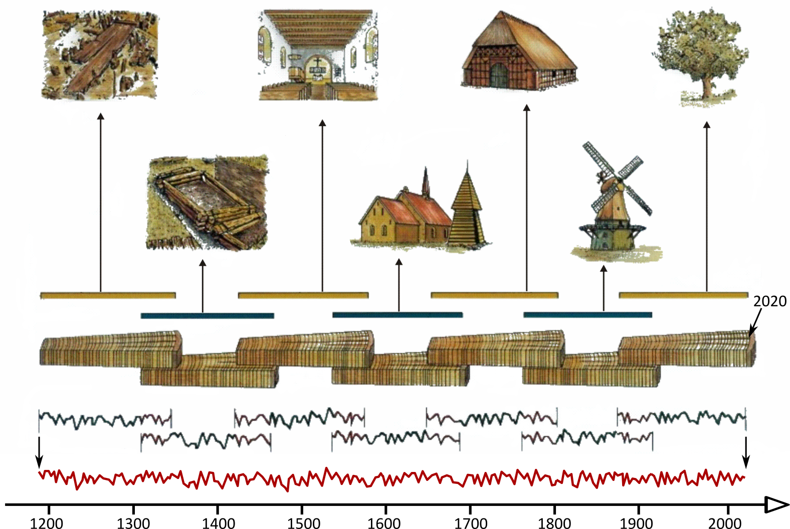

# Basisbegrippen {#basis}

## Van cel tot jaarring

Bomen vormen elk groeiseizoen een nieuwe laag houtcellen. Deze ontstaan door celdeling in het cambium, een uiterst dun laagje weefsel net onder de bast bevindt (figuur \@ref(fig:hout3D)). Vanuit het cambium worden naar de binnenzijde van de boom stamcellen gevormd die zich daarna verder ontwikkelen tot houtcellen. Naar de buitenzijde ontwikkelen de stamcellen zich tot de bast. De activiteit van het cambium is echter niet continu. In streken met een gematigd klimaat valt de activiteit van het cambium stil tijdens de winter. De bomen zijn dan in rust en er is geen actieve celdeling. Het nieuwe groeiseizoen start in het voorjaar, wanneer de temperatuur opnieuw stijgt en de dagen langer worden. Op dat moment wordt het cambium terug actief en wordt geleidelijk een nieuwe laag hout (= groeiring) gevormd. In het najaar stop de houtaanwas en wordt het actieve groeiseizoen afgesloten. Op een dwarse doorsnede van een tak of stam zijn de afzonderlijke groeiringen te herkennen als concentrische cirkels. Aangezien in onze (klimatologische) regio één groeiseizoen altijd binnen één kalenderjaar valt, is jaarring een perfect synoniem voor groeiring. In Mediterraan gebied of in de tropen is dit niet altijd het geval, en betekent 'groeiring' niet noodzakelijk hetzelfde als 'jaarring'.

(\#fig:hout3D)Doorsnede van een stam of tak, met aanduiding van een aantal weefseltypes en anatomische kenmerken

In het voorjaar start de aanmaak van een nieuwe laag hout. Dit voorjaarshout, ook **vroeghout** genoemd, is bij veel houtsoorten iets meer poreus in vergelijking met het hout dat later in het groeiseizoen wordt gevormd: het zogenaamde **laathout** of zomerhout. In het najaar stopt de aanmaak van nieuw hout en gaat het cambium in rust, tot aan het volgende voorjaar. Dan herneemt de cyclus en wordt opnieuw vroeghout aangemaakt. Daardoor vormt er zich steeds weer een abrupte overgang van laathout naar vroeghout, met hun kenmerkende verschillen in de opbouw van het houtweefsel. Dit zorgt ervoor dat de jaarringen meestal goed van elkaar te onderscheiden zijn.

## Jaarringpatronen

De groeiringen in een boom vormen zich niet gelijkmatig. Afhankelijk van de jaarlijkse weeromstandigheden, de globale schommelingen in het klimaat, of de lokale omstandigheden waarin een boom moet groeien, vormen zich bredere of smallere groeiringen.

Het registreren van de jaarringen op een stuk hout is het vertrekpunt van een dendrochronologisch onderzoek. Met 'registreren' wordt (meestal) het opmeten van de breedte van elke jaarring bedoeld. Het is daarbij niet enkel de breedte van elke individuele ring die van belang is, maar vooral het patroon gevormd door de opeenvolging van bredere en smallere ringen. Dit patroon weerspiegelt de opeenvolging van jaren met goede groeiomstandigheden (brede ringen) en minder gunstige groeiseizoenen (smalle ringen). Aangezien de groeiomstandigheden onvoorspelbaar en onregelmatig zijn en van jaar tot jaar verschillen, vormen de jaarringen op elk stuk hout een uniek patroon, vergelijkbaar met een streepjescode, karakteristiek voor een bepaalde tijdsperiode.

>    
> De jaarringen op een stuk hout vormen een uniek patroon, vergelijkbaar met een streepjescode, karakteristiek voor een bepaalde tijdsperiode.
>    

Aangezien de opbouw van het jaarringpatroon in een boom voor een deel gestuurd wordt door klimatologische omstandigheden, kan het jaarringpatroon van meerdere bomen uit een zelfde gebied en binnen eenzelfde tijdsperiode opvallende gelijkenissen vertonen. De individuele bomen reageren immers op dezelfde omgevingsprikkels, die van jaar tot jaar variëren. Daardoor kunnen de jaarringpatronen van bomen die binnen een zelfde regio of klimatologische zone groeien met elkaar gesynchroniseerd worden. Dat wil zeggen dat we die ene, onderlinge positie vinden waarbij alle jaarringpatronen synchroon lopen (figuur \@ref(fig:boorkernen)). 

(\#fig:boorkernen)Twee stukken historisch bouwhout waarvan de opgemeten jaarringbreedtes worden weergegeven in een grafiek. De twee jaarringreeksen vertonen onderling een sterk gelijklopend patroon.

## Synchroniseren

Synchronisatie of ***crossdating*** is het basisprincipe van de dendrochronologie. Hierbij wordt er vanuit gegaan dat bomen die over een bepaalde tijdsperiode gelijkaardige groeiomstandigheden ondervinden (klimaat, bodem, hoogteligging, ...), ook een gelijkaardig jaarringpatroon zullen ontwikkelen. Daardoor kunnen jaarringreeksen van een specifieke boomsoort uit een bepaalde regio onderling, tot op het kalenderjaar precies, gesynchroniseerd worden op basis van de unieke afwisseling van brede en smalle ringen. Zo sporen we op meerdere stukken hout of bij bomen de jaarringen op die in hetzelfde jaar werden gevormd.

Bij het synchroniseren/crossdaten van jaarringpatronen wordt dankbaar gebruik gemaakt van statistische parameters die de overeenkomst tussen jaarringreeksen in een getal uitdrukt. De overeenkomst moet dan hoger liggen dan een bepaalde drempelwaarde vooraleer we de jaarringreeksen aan elkaar vastpinnen. Maar ook een visuele appreciatie van de overeenkomst tussen twee of meerdere jaarringreeksen is onontbeerlijk om tot een betrouwbaar resultaat te komen.

## Kalenders

Een verzameling van meerdere gesynchroniseerde jaarringpatronen afkomstig van bomen die groeiden in een zelfde regio, kunnen gebundeld worden tot één jaarringkalender, of **jaarringchronologie** (= chronologie, referentiekalender, middelcurve, ...). Zo een referentiekalender kan een langere tijdsperiode overspannen dan de individuele jaarringreeksen waaruit ze is opgebouwd (figuur \@ref(fig:synchronisatie)). Dat kan indien oudere stukken hout zijn opgemeten, waarvan het jaarringpatroon overlapt met het jaarringpatroon van meer recente stukken hout. Weten we van één reeks in welk kalenderjaar de laatste groeiring werd gevormd, dan is de referentiekalender absoluut gedateerd. Bij zo een chronologie is geweten in welk kalenderjaar elke ring werd gevormd. Is dit niet het geval, hebben we m.a.w. geen link tussen de jaarringen en de overeenstemmende kalenderjaren, dan kunnen synchroniserende jaarringreeksen toch samengevoegd worden in een zogenaamd 'zwevende' chronologie. In dit geval is de chronologie niet absoluut gedateerd. Wel kunnen de individuele stukken hout dan ten opzichte van elkaar chronologisch geordend worden, zonder dat er evenwel een ijking met een kalenderdatum mogelijk is.

Het jaarringpatroon op een stuk historisch bouwhout, houten object of archeologische vondst laat toe de ouderdom van het hout exact te achterhalen. Dat gebeurt door het opgemeten groeiringpatroon te vergelijken met lange, absoluut gedateerde referentiekalenders. Indien een duidelijke visuele en statistisch betrouwbare overeenkomst wordt gevonden tussen het opgemeten jaarringpatroon en één of meerdere referentiekalenders, is meteen geweten in welk kalenderjaar elke jaarring werd gevormd. Dit maakt van dendrochronologie de meest precieze natuurwetenschappelijke **dateringstechniek**.

(\#fig:synchronisatie)Stukken hout kunnen op basis van het jaarringpatroon, tot op het jaar precies, t.o.v. elkaar gesynchroniseerd worden. Met de opgemeten en gesynchroniseerde jaarringpatronen (= de breedte van elke groeiring) kan een middelcurve (= chronologie = jaarringkalender) berekend worden (rode curve). Een chronologie geeft de gemiddelde jaarringbreedte weer voor elke jaar.

