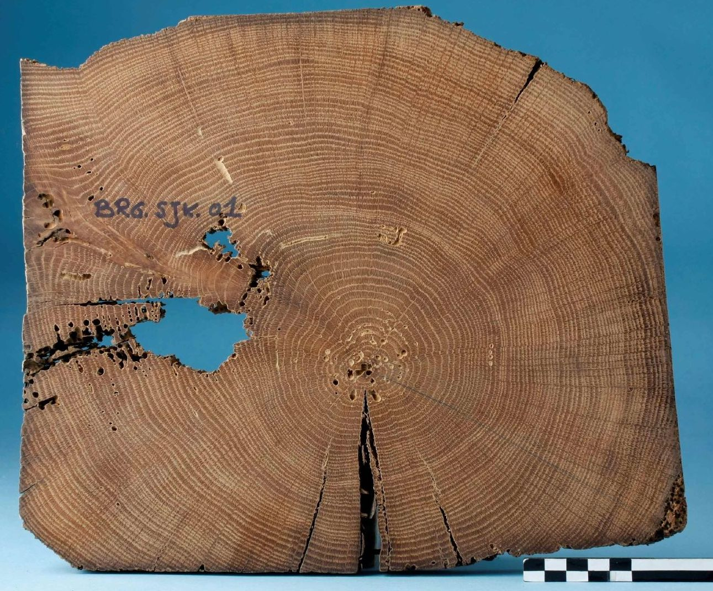

```{r setup, message=TRUE, warning=TRUE, include=FALSE}
library(readxl)
library(tidyverse)
library(kableExtra)

knitr::opts_chunk$set(
  echo = TRUE,
  warning = FALSE,
  collapse = TRUE,
  fig.path = "./figuren/",
  comment = "#>"
  )

```


# Woord vooraf {-}

Welkom bij de online versie van ***Dendrochronologie en erfgoedonderzoek***. Deze handleiding werd in 2017 gepubliceerd door het agentschap Onroerend Erfgoed en is als pdf te downloaden op de [__Open Archives Repositiry (OAR)__](https://oar.onroerenderfgoed.be/item/437).

Met deze online versie willen we kleine aanpassingen aan de originele uitgave, veranderende inzichten en nieuwe toepassingen van dendrochronologie binnen het erfgoedonderzoek - op basis van recente wetenschappelijke ontwikkelingen - sneller ontsluiten. De basis van deze handleiding blijft de originele uitgave, maar hier kan je steeds de meest actuele versie raadplegen.


**Gelieve te citeren als:** <br/> 

Haneca K. (`r Sys.Date()`). Dendrochronologie en erfgoedonderzoek. Handleiding agentschap Onroerend Erfgoed, Brussel  [online: https://hanecakr.github.io/handleidingDendro/]

**Oorspronkelijke gepubliceerd als:** <br/>

Haneca K. (2017). Dendrochronologie en erfgoedonderzoek, Handleiding agentschap Onroerend Erfgoed 16, Brussel [online: https://oar.onroerenderfgoed.be/uitgave/251].

<br/>

 
 
 {width=100%}
 &copy; agentschap Onroerend Erfgoed
